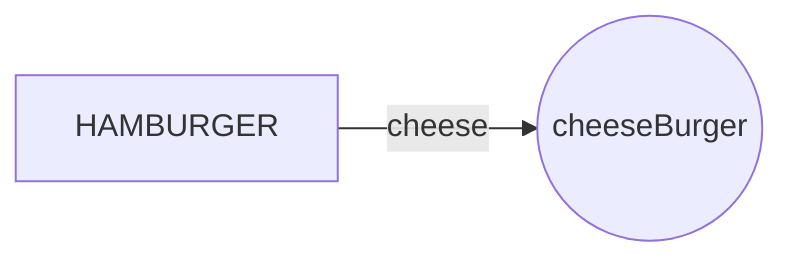

# HALO EVERYNYAN

How are you? Fine thank you.

This is a smol python app I made (chat gpt made) to easily convert images between different formats.

# Files
I just have 1 main.py heh

# Running

**pip stuff**

>pip install Pillow
>pip install pyinstaller

pyinstaller is only necessary to package into an exe. file. Ignore if you're just running the script.
If Tkinter is unrecognised, you can try pip installing it too.

# Packaging
>.venv\Scripts\pyinstaller --onefile --windowed main.py

change the directories as needed. By default, the file will be under the **dist** folder as **main.exe**.

## Burger

hamburger + cheese = cheeseBurger

$$
\Gamma(z) = \int_0^\infty t^{z-1}e^{-t}dt\,.
$$

